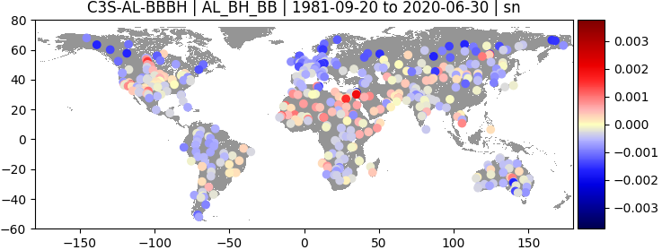
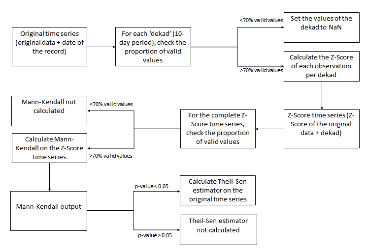

<link rel="stylesheet" href="./css/custom.css">
<!--
<link rel="stylesheet" href="./css/modest.css">
-->

# C3S Quality Monitoring Tool | User Guide

## Objective of the tool
The objective of the tool is to compute albedo, LAI and FAPAR trends based on Mann Kendall test on copernicus v2 data. This tool will used about every 6 months in order to update the trend.

## Usage

### Setup

#### Clone and fortran compilation
Clone the `dev` version:
```properties
git clone --single-branch --branch dev https://github.com/aspyk/vegeo_trend_analysis
cd vegeo_trend_analysis/
./run_setup.sh
```

#### Tests
```properties
pytest test.py -k "AVHRR_plot_all"
pytest test.py -k "S3_extract_all"
```


### Manual run
A manual run is a run where specific time range, sensor and product are given by the user in a command line.
```
python main.py -t0 <start_date> -t1 <end_date> -i <type_of_input> -p <product_tag> -a <action> --config <config_file_path> [-d] [--debug 1]
```
Example:
```
python main.py -t0 1981-01-01 -t1 2020-12-31 -i latloncsv:config -p c3s_al_bbdh_AVHRR c3s_al_bbdh_VGT c3s_al_bbdh_PROBAV -a extract merge trend plot -d --config config_vito.yml
```
With:
 - -t0 START_DATE : start date in iso format `YYYY-MM-DD`.
 - -t1 END_DATE : end date in iso format `YYYY-MM-DD`.
 - -p PRODUCT_TAG : whitespace separated list of tag(s) using the `c3s_<product>_<sensor>` format. `product` can be in `{al_bbdh,al_bbbh,al_spdh,al_spbh,lai,fapar}` and `sensor` in `{AVHRR,VGT,PROBAV,SENTINEL3}`.
- -i INPUT : input type and parameter(s), use the format `<type>:<param1>,<param2>...`. The appropriate input for quality monitoring on LANDVAL sites is `latloncsv:<path_to_csv_file>` but the shortcut option `latloncsv:config` allow to read the input csv file path from the YAML config file.
- -a ACTION : whitespace separated list of possible actions in `{extract,merge,trend,plot}`
- -c CONFIG : path to the YAML config file.
- [-f] FORCE_NEW_CACHE : option to force overwriting of the cache files and reprocess data.
- [-d ] DEBUG : debug option, read only a small subset of all the LANDVAL sites. User have to modify this list in `main.py` file.


### Automatic run
The automatic run can be launch with a single shorter command. The run can loop over:
- the whole available time range, that is from 1981 to the date of the run.
- AVHRR, VGT, PROBAV and SENTINEL3 sensors.
- albedo, LAI and fAPAR products.

The command to run is the following:
```
python main_loop.py -p <product_list> -s <sensor_list>
# With:
# choices for product_list: al_bbdh,al_bbbh,al_spdh,al_spbh,lai,fapar
# choices for sensor_list: AVHRR,VGT,PROBAV,SENTINEL3

# Example:
python main_loop.py -p al_bbdh al_bbbh -s AVHRR VGT PROBAV
```
After a (long) while, cache files and outputs will be available in their respective folder (see following sections).

#### Output redirection
When running a long run it may be better to redirect output to a log file. An option is available only for the automated run using `-r` option, like this:
```
$> python main_loop.py -p al_bbdh -s AVHRR VGT PROBAV -r
Write output to out_20210326_094724.log
Started at 2021-03-24 09:47:24.221320
Finished at 2021-03-24 09:48:14.344854
$>
```
In addition to that, errors are also log in the followings files:
```
traceback_20210326_094724.log
err_20210326_094724.log
```


## Overview of the pipeline
The structure of the tool is composed of a main core pipeline running on a single product, this pipeline looping then on a list of desired products products.

### Inputs
#### C3S data
C3S data are available since 1981 and continue today. Three new global maps are given each month (every ~10 days), giving a total of 36 files for each full year. 
Until now, these files may have several resolutions coming from different sensors :
  - 4km resolution giving a 4200x10800 map (AVHRR sensor)
  - 1km resolution giving a 15680x40320 map (VGT and PROBAV sensors)
  - 300m in the future with SENTINEL3


<figure style="text-align:center">
  
  <figcaption>C3S sensor timeline.</figcaption>
</figure>

#### Reference sites
Reference sites are ~700 points located all over the world. This input is given as a csv file with the following structure:
```
"#";LATITUDE;LONGITUDE;NAME
1;-10.76;-62.3583;ABRACOS_HILL
2;51.75;59.75;ADAMOWKA
[...]
```

<figure style="text-align:center">
  
  <figcaption>All the reference sites on the C3S land mask.</figcaption>
</figure>


#### YAML config file

Config file use the [YAML format](https://yaml.org/). The file is divided into several parts. The first one give parameters about C3S data files, that is mainly their path (under the `root` keyword) and the variables to be analyzed (under the `vars` keyword). Others parameters (`source`, `mode`, `freq`) should not be modified in the scope of the actual C3S global datasets available. Note the use of anchors with `<<: &foo` and `<<: *foo` to avoid repeating the same parameters for several datasets. 

Below is an extract of this part for the AL_BB_DH datasets grouping the 4 sensors:
```yaml
 # AL_BB_DH
 # --------

c3s_al_bbdh_AVHRR:
    root: '/data/c3s_pdf_live/MTDA/C3S_ALBB_DH_Global_4KM_V2/V2.0.1'
    <<: &param
        source: 'c3s'
        mode: 'walk'
        freq: '10D'
    <<: &varbbdh
        var:
            - 'AL_DH_BB'
            - 'AL_DH_NI'
            - 'AL_DH_VI'

c3s_al_bbdh_VGT:
    root: '/data/c3s_pdf_live/MTDA/C3S_ALBB_DH_Global_1KM_V2/V2.0.1'
    <<: *param
    <<: *varbbdh

c3s_al_bbdh_PROBAV:
    root: '/data/c3s_pdf_live/MTDA/C3S_ALBB_DH_Global_1KM_V2/V2.0.1'
    <<: *param
    <<: *varbbdh

c3s_al_bbdh_SENTINEL3:
    root: '/data/c3s_pdf_live/MTDA/C3S_ALBB_DH_Global_300M_V3/V3.0.1'
    <<: *param
    <<: *varbbdh

```

The second part at the end of the file looks like this:
```yaml
 # Dir to store cache and output
output_path:
    extract: './output_extract'
    merge: './output_merge'
    trend: './output_trend'
    plot: './output_plot'
    merged_filename: 'merged_trends.nc'

 # Input file with reference site coordinates
 # (read only if input type = latloncsv)
ref_site_coor:
    AVHRR: './LANDVAL_v1.1.csv'
    VGT: './LANDVAL_v1.1_avhrr_topleft.csv'
    PROBAV: './LANDVAL_v1.1_avhrr_topleft.csv'
    SENTINEL3: './LANDVAL_v1.1_avhrr_topleft.csv'

```
`output_path` section group the folders where cache files and output images and CSV should be written. Each module should always writes its outputs in separate folders to avoid unexpected conflicts.

### Outputs
Outputs of the code are of three types:
- cache files

These files are written between each modules in order to save previous work for being unnecessarily reprocessed, especially for the extract part that can take some time. Cache files have HDF5 format and can be easily read outside of the code if required. Detailed description is given in the module section.

- PNG images

PNG images are written at the end of the last module to plot the result of the trend computation. The format use a scatter plot on a global map with point colored by the value of the slope computed by the Theil-Sen estimator.

<figure style="text-align:center">
  
  <figcaption>Output example where trends in [unit/year] of AL_DH_VI channel over about 20 years is displayed.</figcaption>
</figure>

- CSV files

CSV files are written at the same time as the PNG files and simply export numerical values use to plot the scatter plot as plain text to be used for further analysis if necessary. The format is the same as for the CSV input file containing the LANDVAL sites, new columns are just added to give the statistical parameters computed previously.

### Core pipeline
The core pipeline is made up of 4 modules communicating together only using cache files. These modules are as follow:
- reading module
- merging module
- trend module
- plotting module

The following section is dedicated to their detailed description. A flowchart summarizing the whole structure is given below:

<figure style="text-align:center">
  
  <figcaption>Flowchart of all the modules with their inputs and outputs.</figcaption>
</figure>

## Description of the modules

### Reading module

One-dimensional time series are required for the Mann-Kendall test but inputs are using several formats and resolution (GPS coordinates for LANDAVAL sites and 4KM, 1KM and 300M resolutions for C3S datasets). Then to be able to use the whole time series for statistics computation a first aggregating pre-processing step is required to get uniform data. For that the reading module can be divided in two part: first the extraction part, then the aggregation part.

#### Extraction
One pixel from the lower resolution (~4km) is taken as a surface reference. Then, the following extraction is done for each available resolution:
-	4KM series: simple extraction of the pixel containing the reference site (or 1x1 matrix).
-	1KM series: 4x4 pixel matrix extraction, centered on the 4KM pixel extracted above (and not directly on the reference site to avoid possible large offset)
-	300M series: 12x12 pixel matrix extraction, centered as above on the 4KM pixel.

Note that to simplify the reading of the matrices, a second CSV input file has been automatically created containing the GPS coordinates of the top-left corner of the AVHRR pixel instead of the LANDVAL site initial coordinates.

TODO: So far this task is performed by the tool `TOOL_compare_grid.py`. The function writing the modified input CSV file should be integrated directly in the main code.   

#### Aggregation
Several tests are then applied on all the extracted pixels to consider them as a valid input for the Mann Kendall test. For the matrix cases, these tests are first applied on each pixel of the 4x4 and 12x12 matrices, and if there is more than 75% of valid pixels in them the final unique value is computed averaging the values of all the valid pixels.
The tests used to differentiate the pixels are the following:

Since the Mann Kendall test requires to keep the real time range between the values, resulting value of the test will be either the valid value or a NaN. Note that when two sensors overlap in time, the most recent one overwrites the older.
Therefore, the output of the pre-processing step is a one-dimensional time series for each LANDVAL sites made of 36 time slots per year being filled by either NaN or actual (4KM) or averaged value (1KM or 300M).

##### C3S ALBEDO
Discard pixels (ie apply fill value `-32767`) in the analysis when:
- Outside valid range in AL_* ([0, 10000])
- QFLAG indicates `sea` or `continental water` (QFLAG bits 0-1)
- QFLAG indicates the algorithm failed (QFLAG bit 7)
- *_ERR > 0.2
- AGE > 30

##### C3S LAI and FAPAR
Discard pixels (ie. apply fill value `65535`) in the analysis when:
- Outside valid range in LAI / fAPAR ([0, 65534])
- Fill value in QFLAG (0)
- QFLAG indicates `obs_is_fillvalue` (QFLAG bit 0)
- QFLAG indicates `tip_untrusted` (QFLAG bit 6)
- QFLAG indicates `obs unusable` (QFLAG bit 7)

#### Implementation
python file: **time_series_reader.py**

Since the Mann-Kendall analysis requires to keep the exact time range between all points, the idea here is to create an initial array full of NaN with the shape `(number_of_time_slot, number_of_sites)`, and then for each time slot, if a file is available, extract all the matrices from the file to put them in a `(number_of_sites, matrix_dim[0], matrix_dim[1])` array. Then, aggregation is applied on the latter array to get a 1D array of shape `number_of_sites` that will fill the initial array.  


In the `generic.py` file, a helper class called `CoordinatesConverter` is going to read the list of input GPS coordinates and convert it into a list of ready-to-use `slices` objects adapted to each resolution. For example the following coordinates:
```
673;71.0938;134.978;Republica_Saja_8
```
are converted to the following slice object for the VGT resolution:
```
s = (0, slice(995, 999, None), slice(35274, 35278, None))
```
This slice can then be directly used for array slicing like this:
```
hdf5_file['AL_DH_BB'][s]
```
To get directly the 4x4 matrix:
```
[[6688 6695 6697 6697]
 [6694 6669 6665 6642]
 [6648 6650 6636 6613]
 [6689 6726 6742 6724]]
```

Then, all of these matrices are aggregated in the `_get_c3s_albedo_points` or `_get_c3s_lai_fapar_points` method of the `TimeSeriesExtractor` class in the `time_series_reader.py` file.

The dimension of the output of this extraction will be as said above a `(number_of_time_slot, number_of_sites)` array.

#### Output format
Note that this code was intended to work not only on coordinates list but also on 2D areas. Therefore, to allow the use of the same processing routines for both cases, arrays used for the present points extraction will often have an extra dimension to fit a generic 2D pattern.

The output format of the cache file for the extraction part is the following:
```
timeseries_<start_dekad>_<end_dekad>.h5
 ┣ meta
 ┃ ┣ global_id     Dataset {<time_slot_nb>}
 ┃ ┣ point_names   Dataset {<site_nb>}
 ┃ ┗ ts_dates      Dataset {<time_slot_nb>}
 ┗ vars
    ┣ var_1         Dataset {<time_slot_nb>, 1, <site_nb>} 
    ┣ [...]         Dataset {<time_slot_nb>, 1, <site_nb>}
    ┗ var_n         Dataset {<time_slot_nb>, 1, <site_nb>}
```

Two groups `vars` and `meta` are written in the h5 file.
- The `meta` group contains temporal and geographical references. To keep temporal spacing information, the size of the arrays are fixed using the number of dekads between the start date and the end date. If data is not available at a specific time slot, a NaN or fill value is applied.
  - `point_names` : list of the names of all the extracted points.
  - `ts_dates` : list of all the reference dates for all the extracted files. Use `0` if no data was available at that time slot.
  - `global_id` : similarly to the usual timestamp giving the number of seconds since `1970-01-01 00:00:00`, this array is a list of specific timestamp reduced to the number of dekads since the same reference date. With 36 dekads each year, it means `global_id=0` is the first dekad of 1970, `global_id=35` the last dekad of 1970, `global_id=36` the first dekad of 1971 and so on... This helps to merge different cache files and allow easier processing especially in pandas (you can do `global_id%36` or `global_id//36` to have the index of a dekad in a year or the index of the year since 1970 respectively)
- The `vars` group contains the actual result coming from the aggregation part, that is the list of all the 1D time series for each site ad each variable (i.e. `AL_DH_BB`, `AL_DH_VI` and `AL_DH_NI` for `BBDH` albedo datasets). The arrays are sorted accordingly to the meta variables. 

The name of the cache file is finally given replacing the two placeholders in the following template: `timeseries_<start_dekad>_<end_dekad>.h5`. Dekads are described here with a series of 6 digits using the format `YYYYKK`, `YYYY` being the year with 4 digits and `KK` being the dekad index in the year, between 0 and 35. As an example the cache file for the time range going from 01-01-2000 to 31-12-2001 would be named like this: `timeseries_200000_200135.h5`.

### Merging module

Merging module allow to merge several cache files extracted from the previous part. It does it automatically in the pipeline since one cache file is created for each sensor, but the module could *a priori* merge any cache file from the extracted part.

#### Implementation
python file: **time_series_merger.py**

It uses the `global_id` array to merge files to avoid problems of dates management. As an example, to merge a file with a `global_id` from 100 to 150 and another one from 140 to 200, a new array starting at 100 and going to 200 is created and each dataset is then patched in this new array. In case of overlapping as in this example, the input order is simply used to overwrite data with the same `global_id`. In the pipeline, newer sensors automatically erase the older.

#### Output format
The output format is exactly the same as in the extract module, see above for the details.

### Trend module

The trend module includes the Mann-Kendall test and the Theil-Sen estimator.
The Mann-Kendall test (Mann 1945; Kendall 1975) is a nonparametric test whose objective is to determine whether a monotonic trend exists in a time series. It can be applied to time series containing ties and missing values. The null hypothesis of the test (H<sub>0</sub>) is that the observations are a random sample of n variables that are independent and identically distributed; the alternative hypothesis (H<sub>1</sub>) is that a monotonic trend (either upwards or downwards) is present.  
The Mann-Kendall test assumes that there is no correlation among observations of the time series. To account for this assumption, the Mann-Kendall test is applied on the Z-Scores of the original series. The Z-score (Peters et al. 2002) is calculated as:

<figure style="text-align:center">
  
  <figcaption>Z-score formula.</figcaption>
</figure>

Where x<sub>ijk</sub>  is the value of the variable (albedo, LAI or fAPAR) for a LANDVAL site i, dekad j (i.e each of the 36 10-day periods of a year), and year k; μ<sub>ij</sub> is the mean of the variable at LANDVAL site i and dekad j over k years; and σ<sub>ij</sub> is the standard deviation of the variable at LANDVAL site i and dekad j over k years.
For each dekad, the Z-Score is calculated only if at least 70% of the values are non-missing; the Mann-Kendall test is applied only if the time series of Z-Scores has at least 70% of non-missing values.
The Theil-Sen estimator (Theil 1950; Sen 1968) is a nonparametric procedure to calculate the change of a variable per unit time. It is computed by calculating the slope between all data pairs as follows (Gilbert 1987):

<figure style="text-align:center">
  
  <figcaption>Theil-Sen estimator.</figcaption>
</figure>

Where x<sub>jk'</sub> and x<sub>jk</sub> are the values of the variable at periods jk' and jk, respectively, and jk'>jk. The median of the Q values is the Theil-Sen slope estimator.
The Theil-Sen estimator is calculated on the original time series only if the Mann-Kendall test has been significant (p < 0.05). It is expressed as rate of change per year (year<sup>-1</sup>).

#### Implementation

python file: **compute_trends.py**

<figure style="text-align:center">
  
  <figcaption>Flowchart of the computations performed in the trend module.</figcaption>
</figure>

#### Output format

Output file of the trend module are h5 files with the following structure:
```
merged_trends_<start_dekad>_<end_dekad>.h5
 ┣ var_1
 ┃ ┣ len     Dataset {1, <site_nb>}
 ┃ ┣ pval    Dataset {1, <site_nb>}
 ┃ ┣ slope   Dataset {1, <site_nb>}
 ┃ ┗ zval    Dataset {1, <site_nb>}
 ┗ var_2
    ┣ idem        
    ┗ [...]        
```
Where all the results are given for each LANDVAL sites using the same order as input files. The 4 variables in each group are:
- `len` : number of valid points in the time series used for the trend computation.
- `pval` : p-value of the z-score scaled time series
- `slope` : slope computed on the physical scaled (original) time series
- `zval` : Mann-Kendall statistics  

### Plotting module

Plotting module generates scatter plot on global map to display the trend results. Several maps are created for each of the 4 output (`len`, `pval`, `slope`, `zval`) of the trend algorithm. The scatter plot shows the points at the LANDVAL sites location colored by these variables.

Note that the `zval` shown in the plot corresponds with the Mann-Kendall test Z-statistic (one value per time series), and not with the Z-score calculated during the pre-processing (one value per observation).

#### Implementation
python file: **trend_file_merger.py**

Nothing specific here, simple plotting function.

#### Output format

### Summary of the module structure

<figure style="text-align:center">
  
  <figcaption>Summary of modules actions.</figcaption>
</figure>

The following figure give a detailed call graph of the previous flowchart for the case with following arguments:
```
-t0 1981-01-01 -t1 2020-12-31 -i latloncsv:config -p c3s_al_bbdh_AVHRR c3s_al_bbdh_VGT c3s_al_bbdh_PROBAV -a extract merge trend plot --config config_vito.yml
```
Note that this case has been hardcoded in the main file `main_loop.py` only for example purpose and concerns only the albedo BB_DH product. In a normal mode all products would be processed by the code.

<figure style="text-align:center">
  
  <figcaption>Call graph of the code with python, input and output files.</figcaption>
</figure>


## FAQ

- How to change output paths ?
You can change the output paths in the last section of the YAML config file.

- How to change the QFLAG filtering ?
Aggregation are done in the `_get_c3s_albedo_points` or `_get_c3s_lai_fapar_points` method (depending of the product) of the `TimeSeriesExtractor` class in the `time_series_reader.py` file. Note that you may implement your own filtering method and call it in the `extract_product` method as the two previous ones.


## References

- Gilbert, R.O. 1987. Statistical methods for environmental pollution monitoring. New York: Van Nostrand Reinhold Company.

- Kendall, M.G. 1975. Rank Correlation Methods. 4th edition. London: Charles Griffin.

- Mann, H.B. 1945. Non-Parametric Tests against Trend. Econometrica. 13(3), pp.245-259.

- Peters, A.J., Walter-Shea, E.A, Ji, L., Hayes, M., Svoboda, M.D. 2002. Drought monitoring with NDVI-based standardized vegetation index. Photogrammetric engineering and remote sensing. 68(1), pp.71-75.

- Sen, P.K. 1968. Estimates of the regression coefficient based on Kendall's tau. Journal of the American Statistical Association. 63(324), pp.1379-1389.

- Theil, H. 1950. A rank-invariant method of linear and polynomial regression analysis I, II, III. Proceedings of the Koninklijke Nederlandse Akademie van Wetenschappen. 53, pp.386–392, 521–525, 1397–1412
